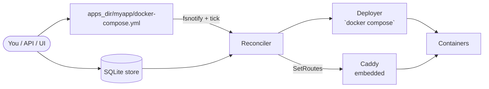

import { Card, CardGrid, Aside } from '@astrojs/starlight/components';

SimpleDeploy is a single Go binary that runs on one Linux box and manages Docker Compose apps for you. It owns the reverse proxy (embedded Caddy), TLS certificates, metrics, alerts, scheduled backups, and a small dashboard. No agent, no cluster, no control plane.

## What it manages

<CardGrid>
  <Card title="Apps" icon="rocket">
    A Compose project on disk at `apps_dir/<slug>/docker-compose.yml`. One project per app.
  </Card>
  <Card title="Endpoints" icon="seti:html">
    Public `(domain, service:port, tls)` triples declared via `simpledeploy.endpoints.*` labels in Compose.
  </Card>
  <Card title="Users + API keys" icon="user">
    Local users (bcrypt + JWT cookie sessions) and `sd_`-prefixed API keys (HMAC-SHA256). Per-app RBAC.
  </Card>
  <Card title="Backups" icon="approve-check">
    Per-app cron jobs against pluggable strategies (postgres, mysql, mongo, redis, sqlite, volume) and targets (local, S3).
  </Card>
  <Card title="Alerts" icon="warning">
    Threshold rules over CPU / memory metrics, dispatched as webhooks (Slack, Discord, Telegram, custom).
  </Card>
  <Card title="Metrics" icon="chart">
    Container stats sampled from the Docker API plus host stats, rolled up into 5 tiers (raw, 1m, 5m, 1h, 1d).
  </Card>
</CardGrid>

## How state flows

SimpleDeploy is a desired-state system. The desired state lives in two places: the compose files on disk under `apps_dir/`, and SQLite rows that hold metadata (registries, backup configs, alert rules, users). The current state lives in Docker.

A reconciler watches `apps_dir/` and, on every change or timer tick, diffs desired against current. New or changed apps get a `docker compose up`. Removed apps get a `docker compose down`. Routes are recomputed and pushed into the embedded Caddy via `caddy.Load()`.

<Aside type="note">
The reconciler is the only thing that should mutate Docker state. Anything else (CLI, API, UI) writes a compose file or a DB row and lets the loop converge.
</Aside>

## Single-binary boundary

Everything runs in one process. The dashboard, REST API, reconciler, metrics collector, alert evaluator, backup scheduler, and Caddy are all goroutines sharing one SQLite file. See [/internal/](https://github.com/vazra/simpledeploy/tree/main/internal) for the package layout.

Read [How it works](/simpledeploy/concepts/how-it-works/) for the full request walkthrough, or [Architecture overview](/simpledeploy/architecture/overview/) for the deep dive.
