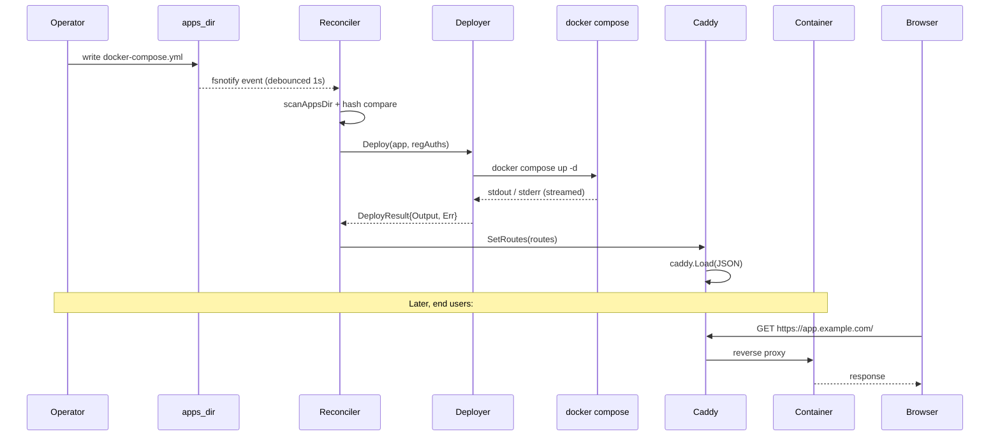

Follow one request from "I edited a YAML file" to "the browser got bytes."

## The path

1. You drop or edit `apps_dir/myapp/docker-compose.yml`. The file declares one or more services and `simpledeploy.endpoints.0.*` labels for any public domains.
2. The reconciler's fsnotify watcher fires (or the next periodic tick runs). It scans `apps_dir/`, parses every `docker-compose.yml`, and computes a SHA-256 of each. It compares the hash against the `compose_hash` row in SQLite.
3. For new or changed apps, the reconciler calls the deployer. The deployer shells out: `docker compose -f <path> -p simpledeploy-myapp up -d --remove-orphans`. Stdout/stderr are streamed line by line into a per-app deploy-log buffer that the UI subscribes to over WebSocket.
4. After every reconcile pass, the reconciler rebuilds the route table from all parsed apps, calls `caddy.Load()` with the new JSON config. Caddy reloads in-place with no socket churn.
5. A request hits Caddy on port 443. Caddy matches by `Host` header, runs the per-app handler chain (IP allowlist, rate limit, request-metrics, then `reverse_proxy`), and forwards to the upstream container.

## Sequence

## What you wrote vs what runs

The compose project name is always `simpledeploy-<slug>`. That label (`com.docker.compose.project`) is how the metrics collector and reconciler find the right containers later. The endpoint upstream is resolved per route: if the service publishes a host port, the route uses `localhost:<host_port>`; otherwise it uses the Docker network address `<service>:<port>` (Caddy is on the host network, but Docker DNS resolution still works for published-network targets when configured).

<Aside type="caution">
Editing the file directly is fine. Editing live containers with `docker compose ...` from a shell is not: the reconciler will not see your change and may overwrite it on the next tick.
</Aside>

## Where each thing lives

- Compose parsing: [/internal/compose/](https://github.com/vazra/simpledeploy/tree/main/internal/compose)
- Reconciler loop: [/internal/reconciler/reconciler.go](https://github.com/vazra/simpledeploy/blob/main/internal/reconciler/reconciler.go)
- Deployer (shells out to `docker compose`): [/internal/deployer/deployer.go](https://github.com/vazra/simpledeploy/blob/main/internal/deployer/deployer.go)
- Caddy config builder + custom modules: [/internal/proxy/](https://github.com/vazra/simpledeploy/tree/main/internal/proxy)
- Log fan-out to WebSocket: [/internal/logbuf/logbuf.go](https://github.com/vazra/simpledeploy/blob/main/internal/logbuf/logbuf.go)
