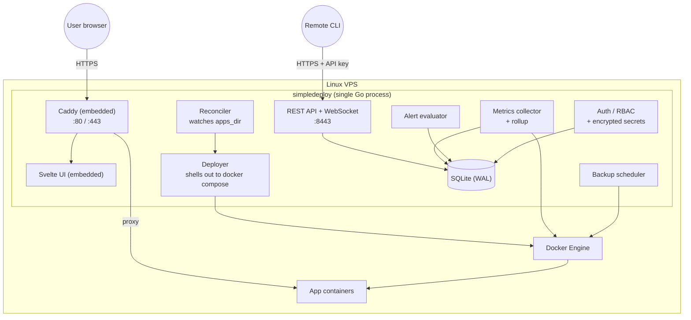

SimpleDeploy is one process. Inside it, several subsystems share state through a SQLite database and coordinate via channels.

## The pieces

**Caddy proxy (embedded).** Listens on 80 and 443. Provisions Let's Encrypt certs automatically. Routes to app containers based on the `simpledeploy.domain` label. Custom Caddy modules add per-app rate limiting and request metrics.

**Reconciler.** Watches `apps_dir` (default `/etc/simpledeploy/apps/`). Each subdirectory is one app. When a `docker-compose.yml` changes, the reconciler diffs against the last known hash and triggers a redeploy.

**Deployer.** Wraps the `docker compose` CLI. Pulls images, brings stacks up, scales services, captures stdout/stderr into a ring buffer that streams to the UI over WebSocket.

**SQLite store.** Single file at `{data_dir}/simpledeploy.db`, WAL mode. Holds apps, users, API keys, metrics, alerts, backup history, deploy events, encrypted registry credentials. Migrations embedded in the binary.

**Metrics collector.** Polls Docker stats and host metrics every 10 seconds. Writes to SQLite via a buffered channel. A rollup loop aggregates raw samples into 1m / 5m / 1h tiers and prunes old data.

**Alert evaluator.** Every 30 seconds, evaluates rules against recent metrics. When a threshold is crossed for the configured duration, it fires webhooks (Slack, Telegram, Discord, or custom JSON).

**Backup scheduler.** Cron-driven. Strategies per database (`pg_dump`, `mysqldump`, `mongodump`, `BGSAVE`, `sqlite .backup`) plus volume tarballs. Targets are S3 (any S3-compatible) or local disk.

**Auth.** Local users with bcrypt passwords, JWT cookies for the UI, API keys for the CLI. RBAC scopes per-user access to specific apps. Registry credentials encrypted with AES-256-GCM using your `master_secret`.

## Source of truth

Compose files in `apps_dir` are the source of truth for app configuration. The dashboard and CLI both end up writing the same files. SQLite holds runtime state (deploy events, metrics, history), not desired state.

<Aside type="note">
This is what makes the system easy to back up and migrate: copy the apps directory and the SQLite file, you have everything.
</Aside>
